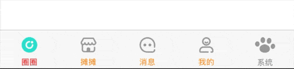

# TabBar
一个高度自定义的`TabBarController`组件，继承自`UITabBarController`。参考[
ESTabBarController](https://github.com/eggswift/ESTabBarController)，在此基础上做了很多改进和优化，在此对作者表示感谢。

# 效果预览
特性|效果|
:-:|:-:|
只显示图片 |  |
显示背景 |  |
指示器 |  |
badge动画 |  |
`GLTabBarItem`和系统`UITabBarItem`混合使用 |  |
不规则item(凸起按钮) |  |
动态改变item宽度 |  |
动态改变item高度 |  |
拦截item点击事件 |  |
显示或者隐藏tabBar |  |
badge的各种样式 |  |
tabBar渐变背景 |  |

# 特性
- 支持修改`tabBar`的高度
- `badge`样式更加丰富，且可以自定义
- 支持自定义按钮，可以实现诸如凸起按钮的效果，超出边界部分默认可以点击
- 支持`GLTabBarItem`和`UITabBarItem`混用
- 可以修改`item`宽度
- 支持自定义每个按钮的颜色，字体，图片等等
- 支持自定义tabBar背景

还有很多特性没列举完，可以查看源码

# 安装
#### 手动
Clone代码，把`Sources`文件夹拖入项目就可以使用了

#### CocoaPods

```
pod 'GLTabBar', :git => "https://github.com/liujunliuhong/TabBar.git"
```
如果提示未找到，先执行`pod repo update`，再执行`pod install`。理论上支持`iOS 8.0`以上系统

# 使用（更多使用方法请查看Demo）
- 以只显示图片的tabBar来举列子

```
private lazy var quanquanItemContainerView: GLTabBarItemContainerView = {
    let quanquanItemContainerView = GLTabBarItemContainerView()
    quanquanItemContainerView.normalImage = UIImage(named: "tab_bar_quanquan_normal")
    quanquanItemContainerView.selectedImage = UIImage(named: "tab_bar_quanquan_selected")
    return quanquanItemContainerView
}()

private lazy var tantanItemContainerView: GLTabBarItemContainerView = {
    let tantanItemContainerView = GLTabBarItemContainerView()
    tantanItemContainerView.normalImage = UIImage(named: "tab_bar_tantan_normal")
    tantanItemContainerView.selectedImage = UIImage(named: "tab_bar_tantan_selected")
    return tantanItemContainerView
}()

private lazy var messageeItemContainerView: GLTabBarItemContainerView = {
    let messageeItemContainerView = GLTabBarItemContainerView()
    messageeItemContainerView.normalImage = UIImage(named: "tab_bar_message_normal")
    messageeItemContainerView.selectedImage = UIImage(named: "tab_bar_message_selected")
    return messageeItemContainerView
}()

private lazy var meItemContainerView: GLTabBarItemContainerView = {
    let meItemContainerView = GLTabBarItemContainerView()
    meItemContainerView.normalImage = UIImage(named: "tab_bar_me_normal")
    meItemContainerView.selectedImage = UIImage(named: "tab_bar_me_selected")
    return meItemContainerView
}()
```
```
let quanquanItem = GLTabBarItem(containerView: self.quanquanItemContainerView)
let tantanItem = GLTabBarItem(containerView: self.tantanItemContainerView)
let messageItem = GLTabBarItem(containerView: self.messageeItemContainerView)
let meItem = GLTabBarItem(containerView: self.meItemContainerView)

let vc1 = OnlyImageViewController()
let vc2 = OnlyImageViewController()
let vc3 = OnlyImageViewController()
let vc4 = OnlyImageViewController()
let navi1 = Navi(rootViewController: vc1)
let navi2 = Navi(rootViewController: vc2)
let navi3 = Navi(rootViewController: vc3)
let navi4 = Navi(rootViewController: vc4)

navi1.tabBarItem = quanquanItem
navi2.tabBarItem = tantanItem
navi3.tabBarItem = messageItem
navi4.tabBarItem = meItem

self.viewControllers = [navi1, navi2, navi3, navi4]
```

# 注意事项
- 框架支持的`item`数量不能大于5个。
- `GLTabBarItem`虽然继承自`UITabBarItem`，但是舍弃了`UITabBarItem`的很多属性，请尽量不要设置`UITabBarItem`的属性，尽量使用`GLTabBarItemContainerView`。
- 如果设置`GLTabBar`的`layoutType`属性为`fillUp`时，在刘海屏手机上会发现图片和文字之间的间距过大，请自行设置`inset`属性。

# 更新记录(倒叙)
### 1、1.0.0（2020.11.03）
- 发布首个版本

# 补充
该仓库会不断进行优化，在使用过程中，有任何建议或问题，欢迎提issue，或者通过邮箱1035841713@qq.com联系我<br>
喜欢就star❤️一下吧